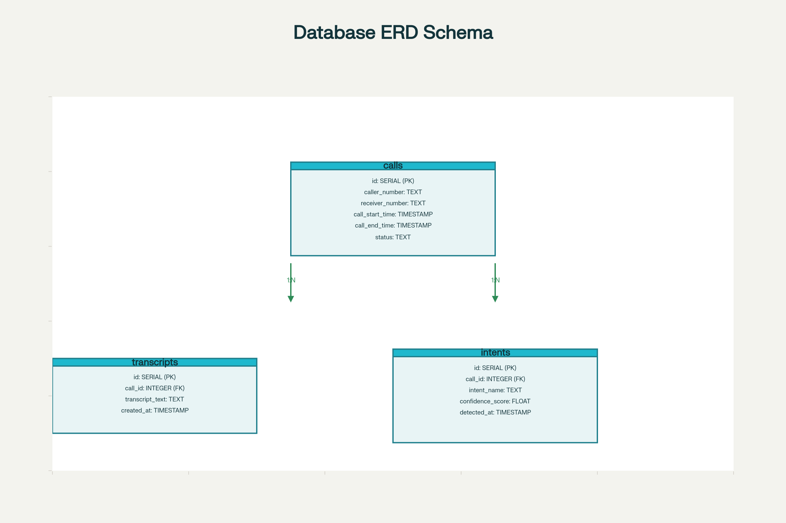

# Database Schema - urdu_voice_ai

## Tables

### calls

| Column          | Type       | Description                    |
|-----------------|------------|-------------------------------|
| id              | SERIAL PK  | Primary key                   |
| caller_number   | TEXT       | Phone number of caller        |
| receiver_number | TEXT       | Phone number of receiver      |
| call_start_time | TIMESTAMP  | Call start timestamp          |
| call_end_time   | TIMESTAMP  | Call end timestamp            |
| status          | TEXT       | Call status (e.g., completed)|

### transcripts

| Column          | Type       | Description                    |
|-----------------|------------|-------------------------------|
| id              | SERIAL PK  | Primary key                   |
| call_id         | INTEGER FK | Foreign key to calls.id       |
| transcript_text | TEXT       | Call transcript text          |
| created_at      | TIMESTAMP  | Creation timestamp            |

### intents

| Column          | Type       | Description                    |
|-----------------|------------|-------------------------------|
| id              | SERIAL PK  | Primary key                   |
| call_id         | INTEGER FK | Foreign key to calls.id       |
| intent_name     | TEXT       | Detected intent name          |
| confidence_score| FLOAT      | Confidence score (0-1)        |
| detected_at     | TIMESTAMP  | Detection timestamp           |

## Relationships

- Each **call** can have multiple **transcripts** and **intents**.
- `call_id` in `transcripts` and `intents` tables refer to `id` in `calls`.

## ERD Diagram

## ERD Diagram

---

## Notes

- `SERIAL PK` indicates auto-incrementing primary key.
- `TIMESTAMP` fields should be stored in UTC timezone.
- Above schema supports storing multi-part call data, transcript texts, and intent recognition results.

